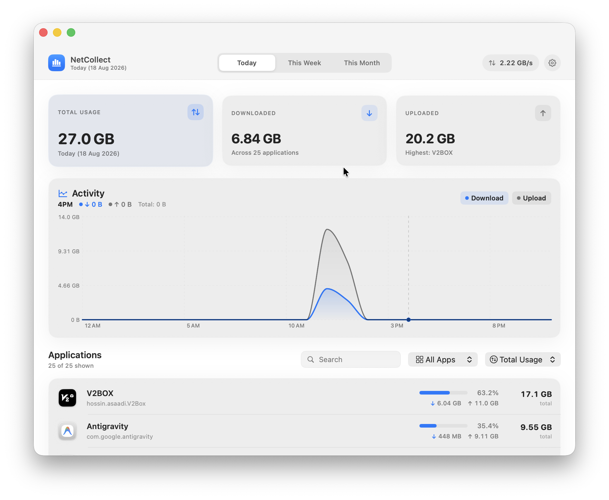
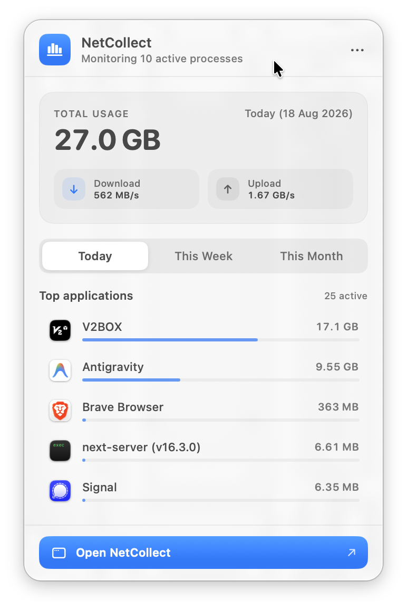

# NetCollect

NetCollect is a macOS app that monitors network data usage per application. It tracks downloads and uploads across today, the current week, the current month, and all time.

Written in Swift using SwiftUI, Swift Charts, `nettop`, and SQLite.

---

## Preview

<p align="center">
  
</p>

<p align="center">
  
</p>

---

## Features

- **Timeframe tracking**: View usage by day, week, month, or total history.
- **Live bandwidth speeds**: Shows current upload and download rates in the menu bar and dashboard window.
- **App grouping**: Groups helper processes (like Chrome renderers or Spotify helpers) under their main application.
- **Activity graph**: Interactive chart showing bandwidth over time with hover inspection.
- **Menu bar and window modes**: Keep it in the menu bar for quick checks, or open the main window to search, filter by system/user apps, and sort by usage.
- **Local storage**: Stores history in a local SQLite file at `~/Library/Application Support/NetCollect/netcollect.sqlite`. No data leaves your Mac.
- **Low resource usage**: Uses less than 0.1% CPU in the background and under 25 MB of memory.

---

## Requirements

- macOS 14.0 (Sonoma) or later
- Apple Silicon or Intel Mac
- Xcode 15+ or Swift 6.0+ (to build from source)

---

## Installation and running

### Run the app bundle
```bash
open NetCollect.app
```
You can also drag `NetCollect.app` into `/Applications`.

### Run with Swift Package Manager
```bash
swift run NetCollect
```

### Run tests
```bash
swift run NetCollectTests
```

---

## Building from source

Run the build script to compile the release binary and generate `NetCollect.app`:

```bash
./Scripts/build_app.sh
```

The script compiles with `swift build -c release`, generates the app icon, and bundles everything into `NetCollect.app`.

---

## Project structure

```
NetCollect/
├── Package.swift                    # Swift package manifest
├── NetCollect.app/                  # Application bundle
├── Sources/
│   ├── NetCollect/                  # App entry point (main.swift)
│   └── NetCollectCore/              # Application logic and UI
│       ├── App/                     # App lifecycle and menu bar setup
│       ├── Models/                  # Data types (records, bandwidth, chart points)
│       ├── Services/                # Network collector (nettop), resolver, SQLite
│       ├── ViewModels/              # App state
│       └── Views/                   # Dashboard, menu bar popup, settings
├── Tests/
│   └── NetCollectTests/             # Unit test suite
└── Scripts/
    ├── build_app.sh                 # Build and packaging script
    ├── create_icns.sh               # Icon converter
    └── generate_icon.swift          # Icon generation script
```

---

## Keyboard shortcuts

| Shortcut | Action |
| --- | --- |
| <kbd>⌘</kbd> <kbd>,</kbd> | Open settings |
| <kbd>⌘</kbd> <kbd>W</kbd> | Close dashboard window |
| <kbd>⌘</kbd> <kbd>Q</kbd> | Quit NetCollect |

---

## License

MIT License. See [LICENSE](LICENSE) for details.
